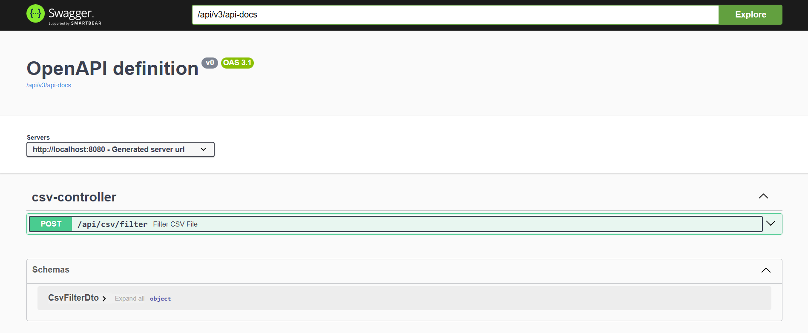
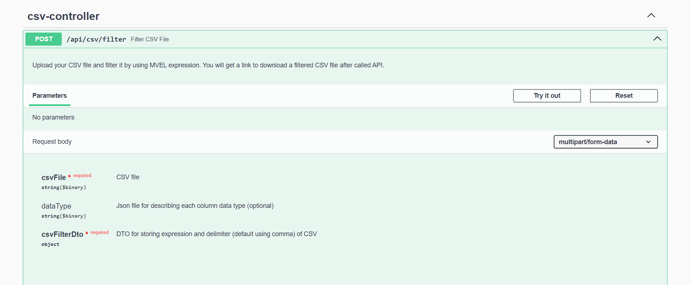
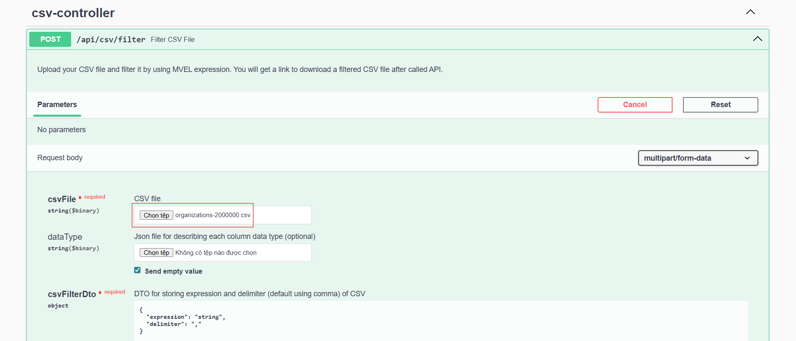
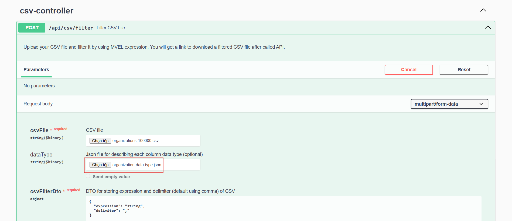
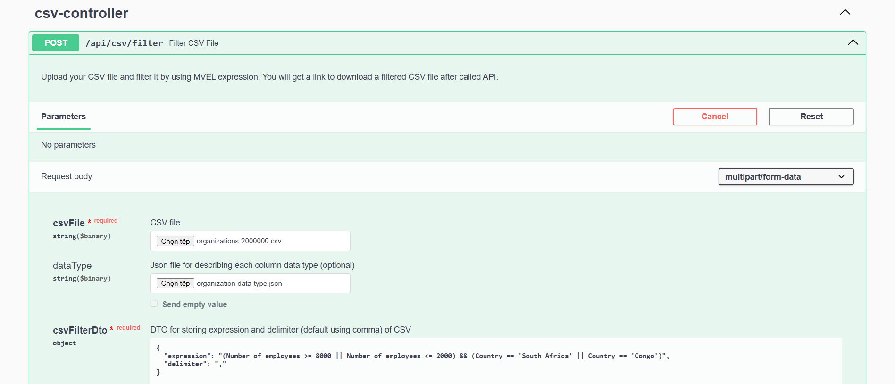
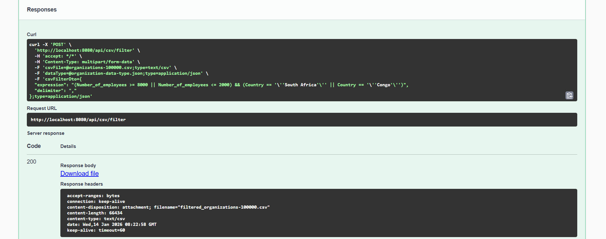

# CSV Filter Service

A Spring Boot service that filters large CSV files using **MVEL expressions** with **lazy column parsing** for high performance.

This project is designed to handle large CSV files (100MB+) efficiently by parsing only the columns that are actually used in the filter expression.

---

## 🚀 Features

- Upload CSV file and filter rows using MVEL expressions
- Lazy parsing per column (parse only when needed)
- Support custom column data types via JSON config
- Efficient streaming processing (memory-friendly)
- Works with large CSV files

---

## 🛠️ Tech Stack
- Java 21
- Spring Boot
- Maven
- Apache Commons CSV
- MVEL (MVFLEX Expression Language)

---

## 📁 Project Structure
```text
├── docs
│   └── images
├── sample-data
│   ├── organization-data-type.json
│   ├── organizations-100000.zip
│   └── README.md
├── scripts
│   └── download-sample-data-large-size.sh
├── src
│   ├── main
│   │   ├── java
│   │   │   └── com.hieunn.mvel
│   │   │       ├── configs
│   │   │       ├── controllers
│   │   │       ├── dtos
│   │   │       ├── exceptions
│   │   │       ├── filters
│   │   │       ├── mvel
│   │   │       ├── services
│   │   │       ├── utils
│   │   │       └── MvelApplication.java
│   │   └── resources
│   │       └── application.yml
│   └── test
├── pom.xml
└── README.md
```

---

## ✅ Prerequisites
Make sure you have the following installed:
- **Java JDK 21 or later**
- **Maven 3.9+**
- Git

Check versions:
```bash
java -version
mvn -version
git --version
```

---

## 📥 Clone the Project
```bash
git clone https://github.com/nn-hieu/mvel.git
cd mvel
```

---

## 📦 Install Dependencies
This project uses Maven.

Run the following command to download and install all dependencies:

(You should run this from the project root folder: `mvel`)
```bash
mvn clean install
```
If you want to skip tests:
```bash
mvn clean install -DskipTests
```

---

## ▶️ Run the Application
Option 1: Run with Maven (Recommended)
```bash
mvn spring-boot:run
```
Option 2: Run as JAR
```bash
mvn clean package
```
After running this command, you will see a `target` folder containing a `.jar` file, for example: `mvel-1.0.0.jar`.

Then run the following command:
```bash
java -jar target/mvel-1.0.0.jar
```
> 📌 **Note**
> - If the .jar file has a different name, replace `mvel-1.0.0.jar` with the actual file name in the command.

---

## 🌐 Application Access
By default, the application runs on:
```text
http://localhost:8080
```
🔹Swagger UI (API Documentation & Testing)

This project provides an interactive Swagger UI for exploring and testing the APIs.

Access Swagger UI at:
```text
http://localhost:8080/swagger-ui.html
```
or
```text
http://localhost:8080/swagger-ui/index.html
```
From the Swagger UI, you can:
- View all available API endpoints
- Inspect request/response models
- Execute API requests directly from the browser
- Test CSV upload and filtering with MVEL expressions

🔹OpenAPI Specification (JSON)

If you need the raw OpenAPI specification:
```text
http://localhost:8080/api/v3/api-docs
```

---

## 📂 Sample Data

Sample CSV files and JSON data type file are available in the [`sample-data`](sample-data) folder.

For detailed information about the sample data format and usage, please refer to:
➡️ [`sample-data/README.md`](sample-data/README.md)

---

## 🧪 Quick Test with Swagger

1. Open Swagger UI: `http://localhost:8080/swagger-ui/index.html`  
   
2. Select the CSV filter endpoint and click `Try it out`  
   
3. Upload a CSV file (in this case I'm using my sample data)
   > - 📂 Sample files can be found in [`sample-data`](sample-data).  
   > - See [`sample-data/README.md`](sample-data/README.md) for details.

   
4. Upload a data type JSON file (optional)  
   
   > 📌 **Note**  
   > If no data type JSON file is provided, the service will automatically detect column data types and cast values at runtime.
5. Provide an MVEL filter expression (e.g.):
   
   ```text
    (Number_of_employees >= 8000 || Number_of_employees <= 2000) && (Country == 'South Africa' || Country == 'Congo')
    ```
   > 📌 **Note**  
   > - Column names containing spaces or special characters are automatically normalized by replacing them with underscores (`_`).
   > - For example: `"Number of employees"` → `Number_of_employees`
6. By default, the CSV delimiter is a comma (,). If your CSV file uses a different delimiter (e.g. ;), please update the delimiter accordingly.
7. Execute the request and download the filtered result (click the link [Download file](README.md))


---

👤 Author

Nguyễn Ngọc Hiếu
